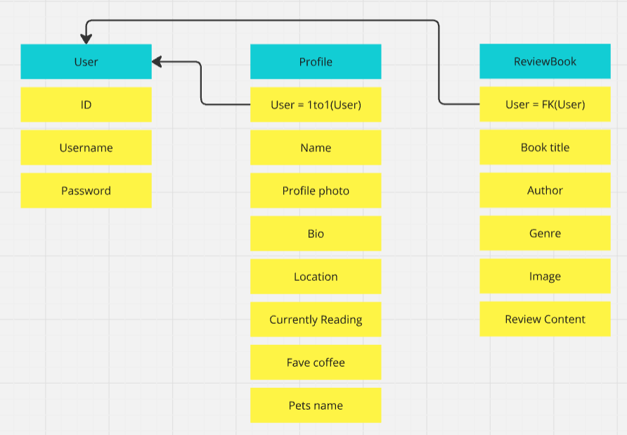

# Cats, Coffee and Covers

-This is the README for the Back-end API - other information can be found in the Front-end repository documentation [here](https://github.com/elamont174/catscoffeecovers).

## Project Overview
- A Django Rest Framework API was made, connected to a PostgreSQL database and deployed to Heroku before being connected to a React application in order to create the website "Cats, Coffee & Covers".

## Agile methodology
- Please see [front-end documentation](https://github.com/elamont174/catscoffeecovers).
- Project board can be found [here](https://github.com/users/elamont174/projects/7).

## Back-end documentation
### Wireframes 
- 

### Database
1. Navigate to [PostgreSQL](https://dbs.ci-dbs.net/) from Code Institute.
2. Enter your email address in the input field provided.
3. Click Submit.
4. Wait while the database is created.
5. Check your email.
6. You now have a URL you can use to connect your app to your database.

### Deployment
Please see separate [DEPLOYMENT.md](DEPLOYMENT.md) file for full deployment steps.

### Testing 
Please see separate [TESTING.md](TESTING.md) file for all testing.

## Languages
- Python

## Technologies used
- [Cloudinary](https://cloudinary.com/)
- Django REST Framework
- Code Institute Postgres Database server

## Credits
- The Code Institute DRF API walkthrough was used as a base to create this API. Customised models were used to make the project unique. 